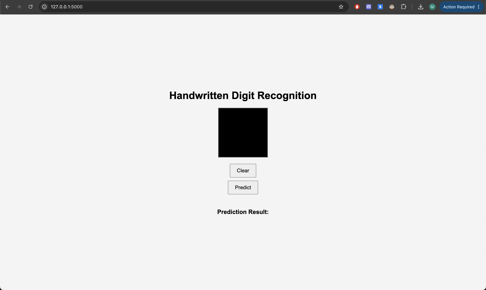
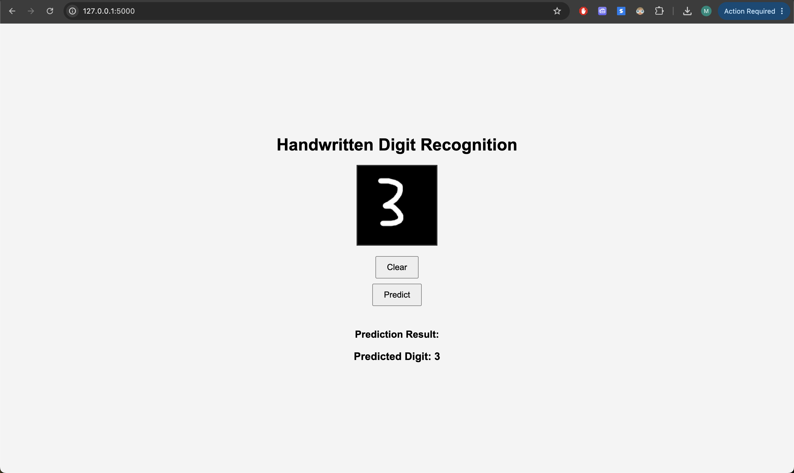

# Neural Network for Handwritten Digit Prediction

This project is a **Neural Network** built from scratch to predict handwritten digits. The network is implemented using just **Python** and **NumPy**, without any external machine learning libraries or frameworks. It can be trained using a simple script, and a web application is provided to allow you to test the network by drawing your own numbers.
**Project Overview**

This project is a simple neural network built for the task of digit classification. It is based on the well-known MNIST dataset, which consists of images of handwritten digits (0-9). The model is trained to recognize these digits and can predict the digit for unseen images.

Additionally, the model can also classify clothing items if opened with the code in the cloth folder, which was derived from the same code used for the number classification task. The clothing dataset is used to test the model’s ability to generalize.

**Important Notes:**

**Code Organization:**
The code for the neural network capable of understanding numbers is located in the number folder.
The code for the clothing dataset is located in the cloth folder. The cloth code is essentially a copy-paste of the number code and was used to test if the model's generalization ability was good for another task.

**Opening the Files:**
It is important that you open the number or cloth folder directly. Do not open the project with the main file (neural_network_) or the paths used in the code may become incorrect.

## Features

- **Training the Model**: You can train the model using the `learn.py` file in the `learning` folder. After training, you can run the `test.py` file to see the accuracy of the model on the test dataset.
- **Accuracy** :
The number classification model has an accuracy of 98.5%.
The clothing classification model has an accuracy of 88.77%.
- **Resetting the Model**: If you want to reset the model's knowledge, simply delete the `model.npz` file. This will remove the saved model, and you can retrain it from scratch.
- **Web Application**: The project includes a simple web app for testing the model by drawing numbers. To run it, go to `app.py`, run it, and visit the indicated link in the browser. Please note that predicting from the drawing feature is **still in beta** and has **low accuracy** at the moment.

## Installation

> **Note:** The instructions below are for the **number** classifier (the `number/` folder), which contains `app.py`, `learning/`, `model.npz` and `requirements.txt`. Every command must be run from inside the `number` folder, because the code loads `model.npz` and the `archive/` dataset using relative paths.

### Clone the Repository
To get started, clone the repository and navigate to the `number` folder:

```bash
git clone https://github.com/MathewAlfrenn/Neural-Network.git
cd Neural-Network/number
```

**Setup Virtual Environment**
Create and activate a virtual environment (venv) for running the project:

```bash
python3 -m venv venv
```
Activate the virtual environment:

**On Windows:**
```bash
venv\Scripts\activate
```
**On macOS/Linux:**
```bash
source venv/bin/activate
```

(On Windows, use `python` instead of `python3`. On macOS/Linux, once the venv is active, `python` also works.)

**Install Requirements**
Once the virtual environment is activated, install the required packages (still inside the `number` folder):

```bash
pip install -r requirements.txt
```

**Training the Model**

Training is optional, because a trained `model.npz` is already included. To train the model, run the following from the `number` folder:
```bash
python learning/learn.py
```
This will train the neural network and save the trained model to model.npz. After training, you can evaluate the accuracy by running:
```bash
python learning/test.py
```
If you want to reset the model's knowledge, simply delete the model.npz file (from the `number` folder):
```bash
rm model.npz
```
**Running the Web Application**

To try out the web application and test the model with your own drawings, run this from the `number` folder (the one that contains `app.py`):

```bash
python app.py
```
Open the indicated link in your browser (usually http://127.0.0.1:5000).
You can draw a digit on the canvas to see the model's prediction.
Note: The feature for predicting from drawings is still in beta and does not achieve high accuracy at this point.

If the terminal prints `No saved model found ... starting fresh`, you are not in the `number` folder, so the model was not loaded. On macOS, if port 5000 is already in use (AirPlay Receiver), turn that off in System Settings or run `flask run --port 5001` instead.

**Web App Screenshot**





**Web App Video Demo**

**Technologies Used**


Python and NumPy: For implementing the neural network from scratch.

Flask: For the web application where users can test the model by drawing digits.

Matplotlib: For visualizing the training and testing results (such as misclassified images).

HTML/CSS/JavaScript: For the frontend of the web application (drawing canvas).

**Requirements**
The required packages are listed in the requirements.txt file. Please ensure all dependencies are installed by following the instructions above.